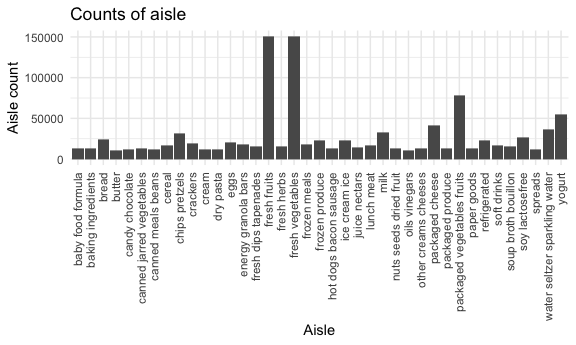

p8105\_hw3\_hz2710
================
Huili Zheng
10/14/2021

Load the datasets.

``` r
data("instacart")
instacart = instacart
```

## Problem 1

The goal is to do some exploration of this dataset.

-   The dataset has 1384617 rows and 15 columns, including of order\_id,
    product\_id, add\_to\_cart\_order, reordered, user\_id, eval\_set,
    order\_number, order\_dow, order\_hour\_of\_day,
    days\_since\_prior\_order, product\_name, aisle\_id, department\_id,
    aisle, department variables.
-   For example, we can see the first row shows that an item shopped in
    an order with id is 1, id of the product is 49302, the first item
    added in the cart was reordered the first time by a user with
    id 112108. It was the 4th time for this user. He bought the product
    at the 10th hour of the day on Thursday. Since the last order, it
    had been 9 days. The product name is ‘Bulgarian Yogurt’. The aisle
    id and name is 120 and ‘yogurt’. The department id and name is 16
    and ‘dairy eggs’.

| order\_id | product\_id | add\_to\_cart\_order | reordered | user\_id | eval\_set | order\_number | order\_dow | order\_hour\_of\_day | days\_since\_prior\_order | product\_name    | aisle\_id | department\_id | aisle  | department |
|----------:|------------:|---------------------:|----------:|---------:|:----------|--------------:|-----------:|---------------------:|--------------------------:|:-----------------|----------:|---------------:|:-------|:-----------|
|         1 |       49302 |                    1 |         1 |   112108 | train     |             4 |          4 |                   10 |                         9 | Bulgarian Yogurt |       120 |             16 | yogurt | dairy eggs |

-   There are 134 aisles here, and the most items ordered from fresh
    vegetables. Fresh vegetables are common and necessary supplies.

-   A plot that shows the number of items ordered in each aisle,
    limiting this to aisles with more than 10000 items ordered.

``` r
plot1 =
  instacart %>%
  group_by(aisle) %>%
  mutate(
    aisle_count = length(aisle)
  ) %>%
  filter(aisle_count > 10000) %>%
  ggplot(aes(x = aisle)) +
    geom_bar() + 
    labs(x = "aisle", y = "aisle count", title = "Counts of aisle") 

plot1
```



-   A table showing the three most popular items in each of the aisles
    “baking ingredients”, “dog food care”, and “packaged vegetables
    fruits”. Include the number of times each item is ordered in your
    table.

``` r
pop_items = 
  instacart %>%
  filter(
    aisle %in% c("baking ingredients","dog food care","packaged vegetables fruits")
  ) %>%
  group_by(aisle) %>%
  count(product_name,name = "product_count") %>%
  top_n(3) %>%
  knitr::kable()
```

    ## Selecting by product_count

``` r
instacart %>%
  filter(
    aisle %in% c("baking ingredients","dog food care","packaged vegetables fruits")
  ) %>%
  group_by(aisle,product_name) %>%
  summarize(product_count = length(product_name)) %>%
  mutate(
    product_count = order(product_count, decreasing = TRUE),
    product_rank_within_aisle = rank(product_count)
  ) %>%
  filter(product_rank_within_aisle <= 3) %>%
  select(-product_rank_within_aisle) %>%
  knitr::kable()
```

    ## `summarise()` has grouped output by 'aisle'. You can override using the `.groups` argument.

| aisle                      | product\_name                                                        | product\_count |
|:---------------------------|:---------------------------------------------------------------------|---------------:|
| baking ingredients         | Low Fat 2% Evaporated Milk                                           |              1 |
| baking ingredients         | Organic Coconut Flour                                                |              2 |
| baking ingredients         | Organic Spelt Flour                                                  |              3 |
| dog food care              | Canine Cuisine Prime Rib Flavor Gourmet Filets in Sauce Wet Dog Food |              1 |
| dog food care              | Choice Cuts In Gravy with Chicken & Rice Dog Food                    |              2 |
| dog food care              | Choice Cuts® Beef Combo                                              |              3 |
| packaged vegetables fruits | Carrots, Bag                                                         |              3 |
| packaged vegetables fruits | Classic Blend Cole Slaw                                              |              2 |
| packaged vegetables fruits | Cocktail Tomatoes                                                    |              1 |

Make a table showing the mean hour of the day at which Pink Lady Apples
and Coffee Ice Cream are ordered on each day of the week; format this
table for human readers (i.e. produce a 2 x 7 table).
