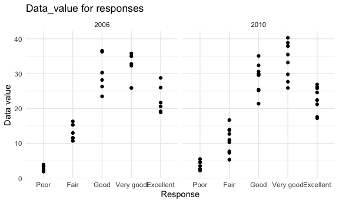

p8105\_hw3\_hz2710
================
Huili Zheng
10/14/2021

Load the datasets.

``` r
data("instacart")
instacart = instacart
```

## Problem 1

The goal is to do some exploration of this dataset.

-   **Size and key variables of the dataset** The dataset has 1384617
    rows and 15 columns, including of order\_id, product\_id,
    add\_to\_cart\_order, reordered, user\_id, eval\_set, order\_number,
    order\_dow, order\_hour\_of\_day, days\_since\_prior\_order,
    product\_name, aisle\_id, department\_id, aisle, department
    variables. The key variables are `product_name`, `aisle`,
    `reordered`

-   **Illustrative example**

| order\_id | product\_id | add\_to\_cart\_order | reordered | user\_id | eval\_set | order\_number | order\_dow | order\_hour\_of\_day | days\_since\_prior\_order | product\_name    | aisle\_id | department\_id | aisle  | department |
|----------:|------------:|---------------------:|----------:|---------:|:----------|--------------:|-----------:|---------------------:|--------------------------:|:-----------------|----------:|---------------:|:-------|:-----------|
|         1 |       49302 |                    1 |         1 |   112108 | train     |             4 |          4 |                   10 |                         9 | Bulgarian Yogurt |       120 |             16 | yogurt | dairy eggs |

Take the first row as an example, we can see the first row shows that an
item shopped in an order with id is 1, id of the product is 49302, the
first item added in the cart was reordered the first time by a user with
id 112108. It was the 4th time for this user. He bought the product at
the 10th hour of the day on Thursday. Since the last order, it had been
9 days. The product name is ‘Bulgarian Yogurt’. The aisle id and name is
120 and ‘yogurt’. The department id and name is 16 and ‘dairy eggs’.

-   **Answer questions**

-   There are 134 aisles here, and the most items ordered from fresh
    vegetables. Fresh vegetables are common and necessary supplies.

-   A plot that shows the number of items ordered in each aisle,
    limiting this to aisles with more than 10000 items ordered.

``` r
aisle_plot =
  instacart %>%
  group_by(aisle) %>%
  mutate(
    aisle_count = length(aisle)
  ) %>%
  filter(aisle_count > 10000) %>%
  ggplot(aes(x = aisle)) +
    geom_bar() + 
    scale_x_discrete(guide = guide_axis(angle = 90)) +
    labs(x = "Aisle", y = "Aisle count", title = "Counts of aisle") 

aisle_plot
```


-   A table showing the three most popular items in each of the aisles
    “baking ingredients”, “dog food care”, and “packaged vegetables
    fruits”.

``` r
pop_items = 
  instacart %>%
  filter(
    aisle %in% c("baking ingredients","dog food care","packaged vegetables fruits")
  ) %>%
  group_by(aisle,product_name) %>%
  summarize(product_count = length(product_name)) %>%
  mutate(
    product_rank = order(order(product_count, decreasing = TRUE)),
  ) %>%
  filter(product_rank <= 3) %>%
  select(-product_rank) %>%
  knitr::kable(caption = "Three most popular items in the aisles")
```

    ## `summarise()` has grouped output by 'aisle'. You can override using the `.groups` argument.

-   A table showing the mean hour of the day at which Pink Lady Apples
    and Coffee Ice Cream are ordered on each day of the week.

``` r
mean_hour = 
  instacart %>%
  filter(
    product_name %in% c("Pink Lady Apples", "Coffee Ice Cream")
  ) %>%
  group_by(product_name,order_dow) %>%
  summarize(mean_order_hour = mean(order_hour_of_day)) %>%
  mutate(
    order_dow = case_when(
      order_dow == 0 ~ "Monday",
      order_dow == 1 ~ "Tuesday",
      order_dow == 2 ~ "Wednesday",
      order_dow == 3 ~ "Thursday",
      order_dow == 4 ~ "Friday",
      order_dow == 5 ~ "Saturday",
      order_dow == 6 ~ "Sunday",
    )
  ) %>%
  pivot_wider(names_from = order_dow,
              values_from = mean_order_hour) %>%
  knitr::kable(caption = "Mean hour of the day at which PLA and CIC were ordered on each day of the week")
```

    ## `summarise()` has grouped output by 'product_name'. You can override using the `.groups` argument.

## Problrm 2

Load the data

``` r
data("brfss_smart2010")
brfss = brfss_smart2010
```

-   **Data cleaning**

``` r
brfss = 
  brfss %>%
  janitor::clean_names() %>%
  rename(
    state = locationabbr,
    location = locationdesc
  ) %>%
  filter(topic == "Overall Health" & response %in% c("Excellent","Very good","Good","Fair","Poor")) %>%
  mutate(
    response = factor(response, levels = c("Excellent","Very good","Good","Fair","Poor"))
  )
```

-   **Answer the question**

``` r
brfss_2002 = 
  brfss %>%
  filter(year == 2002) %>%
  group_by(state,location) %>%
  summarize() %>%
  summarize(observed_time = n()) %>%
  filter(observed_time >= 7) %>%
  select(state,observed_time)
```

    ## `summarise()` has grouped output by 'state'. You can override using the `.groups` argument.

-   In 2002, CT, FL, MA, NC, NJ, PA states were observed at 7 or more
    locations.

``` r
brfss_2010 = 
  brfss %>%
  filter(year == 2010) %>%
  group_by(state,location) %>%
  summarize() %>%
  summarize(observed_time = n()) %>%
  filter(observed_time >= 7) %>%
  select(state,observed_time)
```

    ## `summarise()` has grouped output by 'state'. You can override using the `.groups` argument.

-   In 2010, CA, CO, FL, MA, MD, NC, NE, NJ, NY, OH, PA, SC, TX, WA
    states were observed at 7 or more locations.

``` r
excellent = 
  brfss %>%
  filter(response == "Excellent") %>%
  select(c("year","state","data_value")) %>%
  group_by(state,year) %>%
  mutate(mean_value = mean(data_value, na.rm = TRUE)) %>%
  select(-c(data_value)) %>%
  unique()

excellent_plot = 
  excellent %>%
  ggplot(aes(x = year, y = mean_value, color = state)) +
  geom_line() +
  labs(x = "Year", y = "Mean data value", title = "Average value over time")

excellent_plot
```


-   The trend of the average value over time among these state is
    decreasing during the first 4 years and the gradually rising. The
    range is from about 15 to 30 exclude that the mean value of WY state
    in 2005 was extremely low.

``` r
brfss %>%
  filter(year %in% c(2006,2010) & state == "NY") %>%
  
  ggplot(aes(x = response, y = data_value)) +
  geom_point() +
  facet_grid(. ~year) +
  labs(x = "Response", y = "Data value", title = "Data_value for responses")
```



-   In NY, the distribution of data value in 2006 is similar as in 2010.
    The range of the group “Excellent”, “Poor” and “Good” keeps same.
    The group “Very good” and the group “Fair” have a larger variation
    in 2010 compared to 2006.
